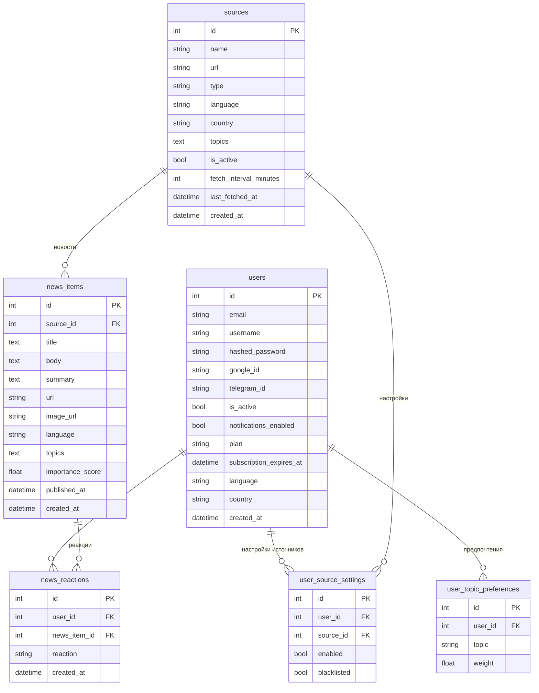

# Database Schema

## Связи

| Таблица | С кем | Тип | Смысл |
|---|---|---|---|
| `users` → `user_topic_preferences` | один ко многим | пользователь выбирает веса тем |
| `users` → `user_source_settings` | один ко многим | пользователь включает/скрывает источники |
| `users` → `news_reactions` | один ко многим | пользователь ставит like/dislike/blacklist |
| `sources` → `news_items` | один ко многим | источник публикует новости |
| `sources` → `user_source_settings` | один ко многим | настройки источника для каждого юзера |
| `news_items` → `news_reactions` | один ко многим | у новости много реакций от разных юзеров |
